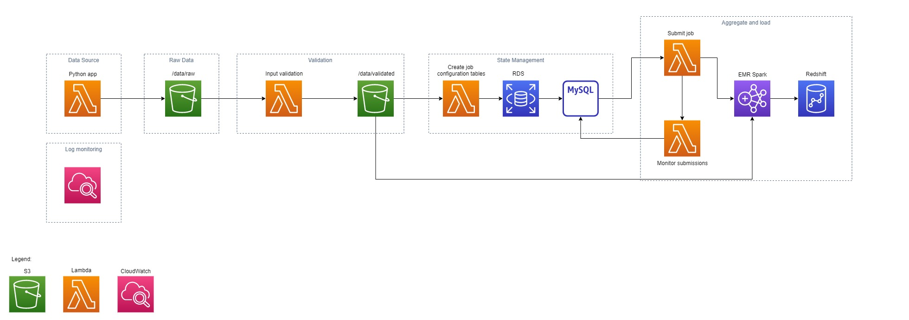

# Sugestão de arquitetura aws

### Diagrama da arquitetura final:

---

Temos apenas uma fonte de dados: arquivos em formato `json` provenientes de uma _api_. No ecossistema AWS, temos duas soluções que são vastamente utilizadas para resolver esse tipo de problema: _Lambda_ e _S3_.

AWS _Lambda_ é um executor de funções _serverless_, ou seja, não precisamos pensar na escala dos servidores da aplicação, apenas em quanto iremos rodar, baseado em eventos ou em algum cronograma. Considerei o _lambda_ como melhor opção pela simplicidade de implementação, como temos uma API como fonte, podemos fazer uma função _lambda_ que puxa os dados da API e os insere no _S3_. Mas por que o _S3_?

o AWS _S3_ é amplamente utilizado como _data lake_, pois nos traz escalabilidade, segurança e organização ao salvar objetos de diversos formatos e schemas. Podemos ter um _bucket_ (estrutura de pasta do _S3_) onde guardamos os dados brutos da nossa API. Salvar dados brutos é importante para consistência, precisamos garantir que caso haja algum problema com a API ou com alguma das etapas sequentes, teremos os dados para reutilização ou checagem.

Já temos nossa base: chamada de API e dados brutos, o que falta? Validação! 

Para validar os dados da nossa API, não precisamos adicionar complexidade à nossa arquitetura, pois com o _lambda_ e com o _S3_ podemos criar uma função que filtre e transforme os dados que considerarmos inoportunos. Nessa etapa, também é importante escolher a extensão de dados que utilizaremos daqui pra frente. Aqui, podemos implementar o que foi feito na etapa 3 do desafio, com uma chamada _lambda_ para o _EMR_, podemos utilizar _spark_ para separar os nossos dados em 2 tabelas relacionais e salvar nosso resultado em formato parquet, que traz diversos benefícios.

temos dados validados e trasnsformados, e agora? 

Um passo importante antes de adicionar dados ao _Redshift_ é criar um controle de estado, o que isso significa? Controle de estado é uma técnica utilizada para classificar nossos _jobs_ (`Running`, `Completed`, `Failed`, etc), ter noção de quais arquivos estão atribuidos a esses _jobs_ e adicionar quaisquer parâmetros que forem julgados necessários antes de um processamento final. Os metadados criados nessa etapa são guardados em uma base relacional, nesse caso o _MySQL_, utilizando o _RDS_, conector da AWS para bancos relacionais.

Para utilizar os metadados criados, precisamos de duas funções lambda separadas, uma que lê os metadados e envia os dados preparados para o job _EMR Spark_ que vai carregar os dados no nosso banco _Redshift_, e outra para monitorar a primeira função e atualizar os metadados de acordo com a saída.

Nosso pipeline está completo, mas ainda precisamos de um monitoramento, para isso, escolhi o _CloudWatch_ pela facilidade de integração com as funções _lambda_, presentes do início ao fim da arquitetura.

Considerações futuras: 

* Possíveis novas fontes de dados.

* Consumo dos dados, visualizações ou preparo para equipes de ciência de dados.

* Caso a complexidade de funções aumentar, considerar o uso de orquestradores como Airflow, Glue ou Step Functions.
